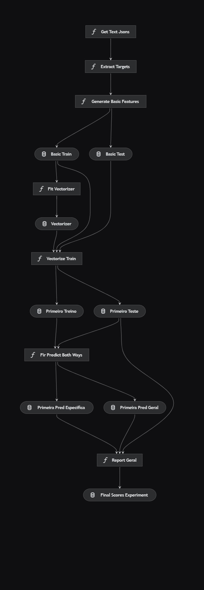

# textgrader
 

## Como rodar

Você pode rodar o projeto da seguinte forma:

```
kedro run --pipeline textgrader
```

  

## Conjuntos de texto

O conjunto de textos trabalhado contém cerca de 170 temas, não há uniformidade nos nomes dos conceitos avaliados e na escala numérica dos conceitos, por isso agrupamos os temas em três grupos diferentes que possuirão conceitos diferentes e escalas numéricas diferentes

### Primeiro conjunto de texto – temas 1 até 85 (cada conceito de  0 a200)
• 'Domínio da modalidade escrita formal',                                                                                                  
• 'Compreender a proposta e aplicar conceitos das várias áreas de conhecimento para desenvolver o texto dissertativo-argumentativo em prosa',   
• 'Selecionar, relacionar, organizar e interpretar informações em defesa de um ponto de vista',                                                 
• 'Conhecimento dos mecanismos linguísticos necessários para a construção da argumentação',                                                     
• 'Proposta de intervenção com respeito aos direitos humanos'           

### Segundo conjunto de texto -  temas 86 até 137 (cada conceito de 0 a 10)
•	'Conteúdo',                                                                                                                               
•	'Estrutura do texto',                                                                                                               
•	'Estrutura de ideias',                                                                                                                 
•	'Vocabulário',                                                                                                                       
•	'Gramática e ortografia' 

### Terceiro conjunto de texto - temas 137 – 170 (cada conceito de 0 a 10)
•	'Adequação ao Gênero Textual',                                                                                                               
•	'Adequação à modalidade padrão da língua',                                                                                                    
•	'Coesão e Coerência'
•	'Adequação ao Tema',                                                                                                                        
•	'Adequação e Leitura Crítica da Coletânea',                                                                                                


## pipeline
 
 


 
